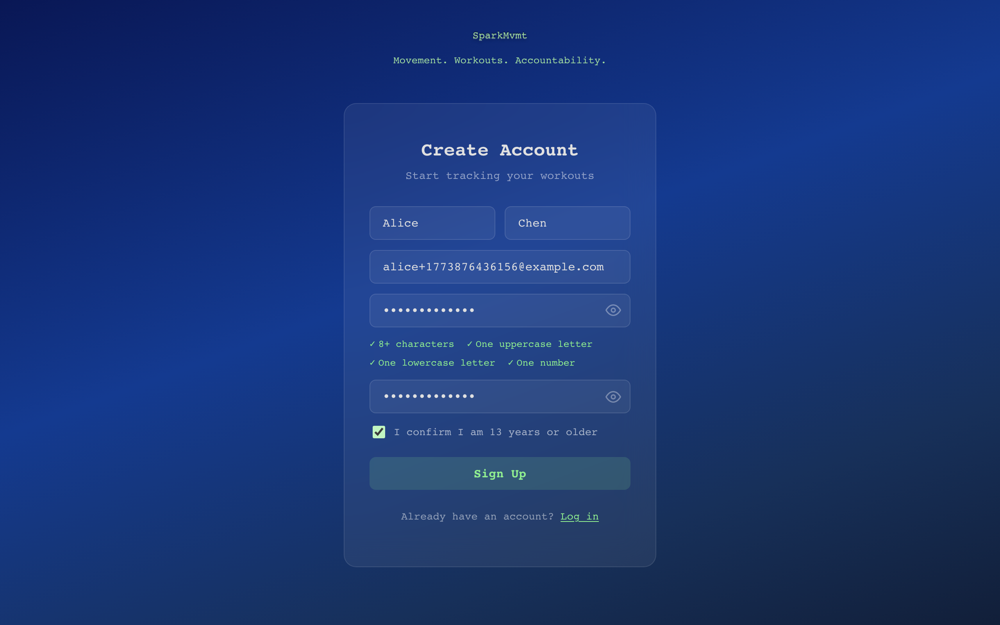
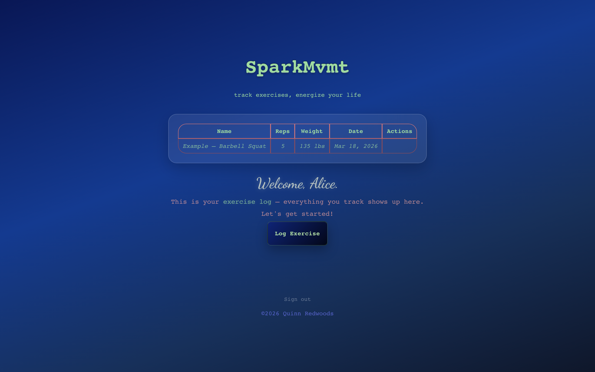
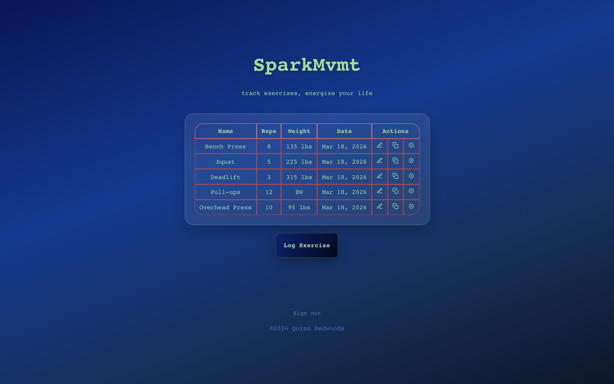
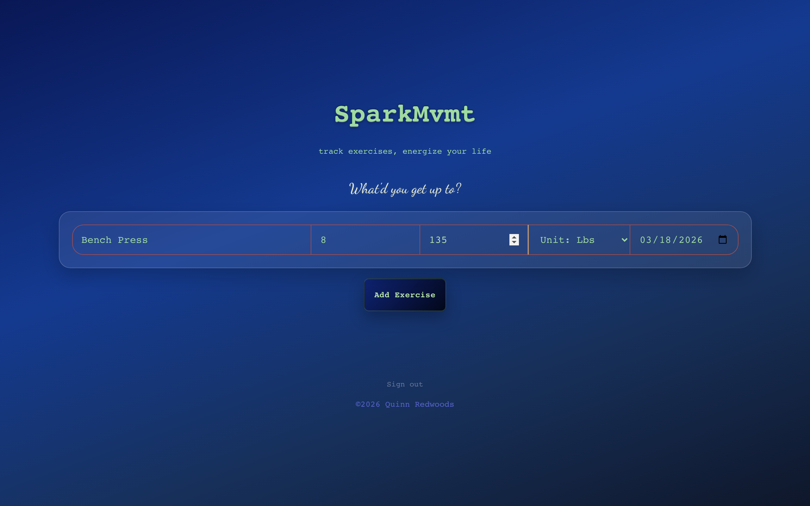

# SparkMvmt

Full-stack exercise tracker with JWT token rotation, httpOnly cookie auth, and Argon2 password hashing.

Built with React, Vite, Express, and MongoDB. Users can log, edit, duplicate, and delete workouts through a responsive single-page UI.

## Screenshots


*Account creation with real-time password validation*


*Empty state with example row and welcome message*


*Home page with logged exercises*


*Exercise form with bodyweight support*

---

## Features

- Log, edit, duplicate, and delete exercises
- Bodyweight exercise support
- Responsive desktop and mobile layouts
- Accessible form controls with keyboard navigation
- Real-time form validation with toast feedback

## Technical Highlights

- JWT access/refresh token rotation with httpOnly cookie storage
- Argon2 password hashing with input length limits
- Silent token refresh on 401 and session restoration on page load
- Object-level authorization — all exercise queries scoped to the authenticated user
- RESTful API with protected routes and middleware auth

---

## Project Structure

```
├── frontend/
│   └── src/
│       ├── pages/          # LoginPage, HomePage, CreateExercise, EditExercise
│       ├── components/     # ExerciseForm, ExerciseTable, ExerciseRow, Toast
│       └── utils/          # API client (token refresh, auth headers), date helpers
├── backend/
│   ├── controller.mjs      # Express app, exercise CRUD routes
│   ├── auth.mjs            # Signup, login, refresh, logout
│   ├── middleware.mjs       # Auth middleware (token verification)
│   ├── model.mjs           # Exercise schema
│   └── userModel.mjs       # User schema
```

---

## Running Locally

### Backend

```bash
cd backend
cp .env.example .env    # add your MongoDB URI and JWT secrets
npm install
npm start
```

You'll need a MongoDB connection string — [MongoDB Atlas](https://www.mongodb.com/resources/products/fundamentals/mongodb-connection-string) offers a free tier.

### Frontend

```bash
cd frontend
npm install
npm run dev
```

Runs at http://localhost:5173. The Vite dev server proxies `/api` requests to the backend on port 3000.

### API Testing

The included `test-requests.http` file covers all endpoints. Use the [REST Client](https://marketplace.visualstudio.com/items?itemName=humao.rest-client) VS Code extension to send requests directly from the file.

---

## Design Decisions

### Auth Architecture
Short-lived access tokens held in memory, long-lived refresh tokens in httpOnly cookies. Access tokens are never persisted to localStorage to limit XSS exposure.

Argon2 over bcrypt for password hashing due to resistance to GPU-based attacks. Input length limits prevent hash-based DoS. The frontend API client handles silent token refresh on 401 and session restoration on page load, so users stay logged in across tabs without tokens in storage.

### Demo Mode
A `DEMO_READ_ONLY` flag disables write operations, allowing the app to be deployed publicly without exposing the database to modifications.

### Accessibility
Button elements for all actions, `aria-label` on icon buttons, preserved focus states for keyboard navigation.

---

## Roadmap

- AWS deployment (EC2, ALB, CloudFront, S3)
- Email verification and password reset (SES or SendGrid)
- Exercise name autocomplete
- Workout grouping (multiple exercises per session)
- Support for distance, time-based, and freeform activities (runs, hikes, classes)
- Workout planning with completion tracking and rep reporting
- Post-workout reflection (how it felt)
- Exercise recommendations based on training history
- Stripe integration for premium features

**Long-term vision:** LLM-powered coaching — build a plan, get feedback on a session, and talk through what's next. The goal is for users to come here not just to log, but to move.

---

## License

MIT License

---

## Author

Quinn Redwoods
