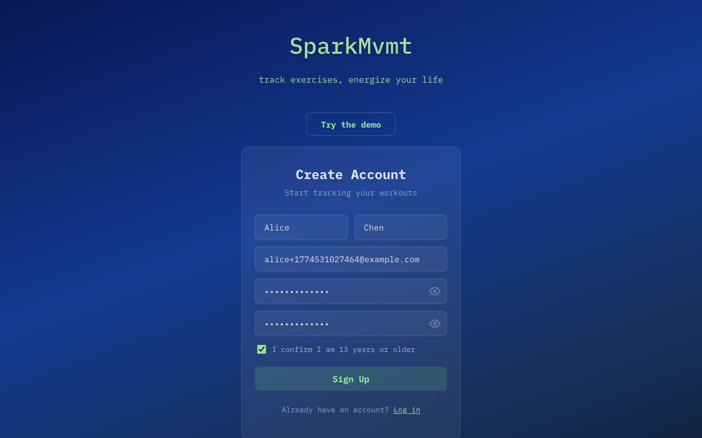
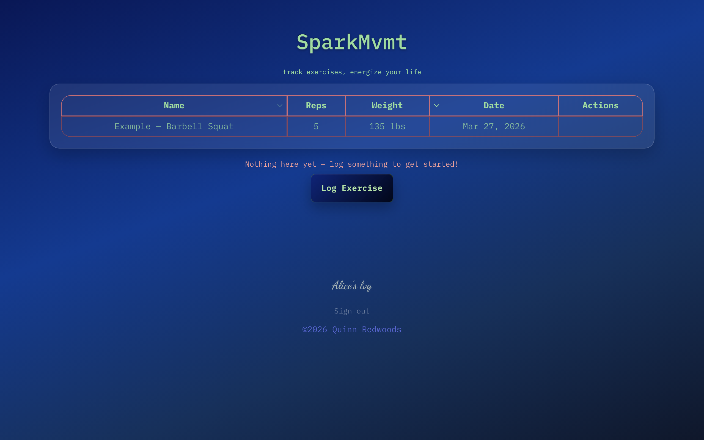
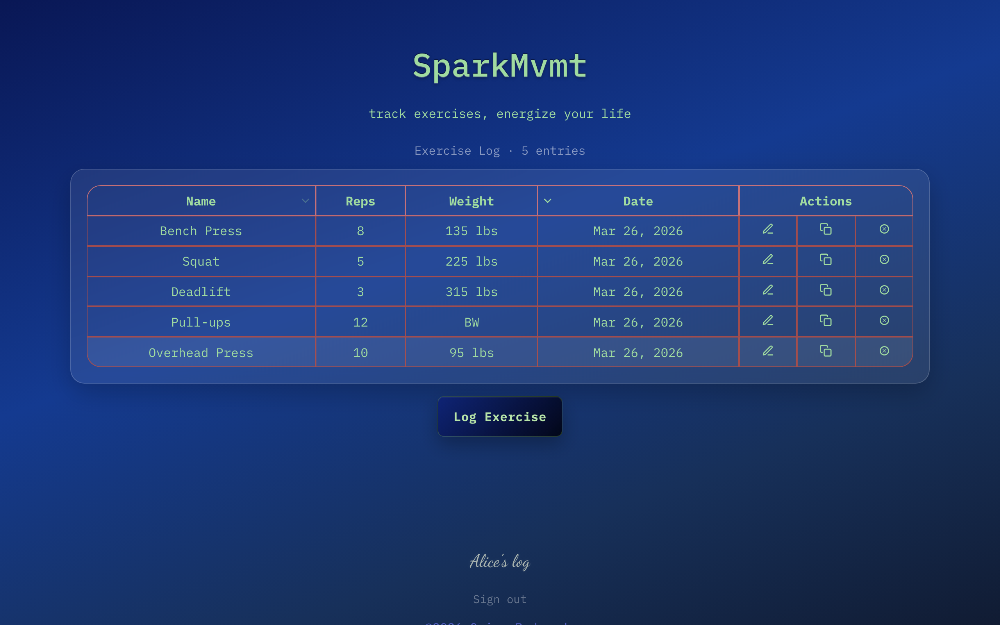
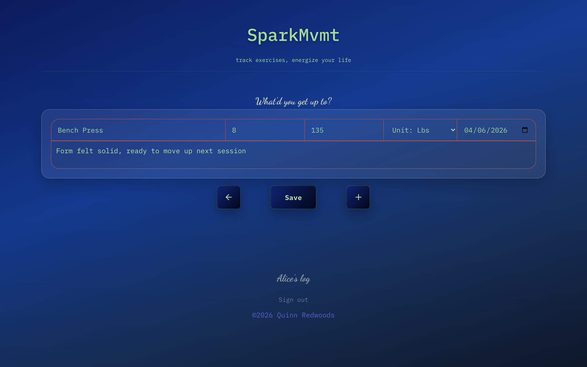

# SparkMvmt

**[Live Demo →](https://sparkmvmt.com)**

Full-stack exercise tracker for logging workouts and getting something meaningful back from the habit. A dashboard reflects activity with adaptive exercise counts, editable purpose, and latest PR surfacing, while exercise names and notes are encrypted on your device before they leave the browser. One-click demo mode lets anyone try it instantly.

Fitness apps often surface data that can trigger sensitive conditions and pressure users with streaks and shame-based metrics. SparkMvmt takes the opposite approach: the dashboard adapts to encourage momentum, greetings welcome you back without guilt, and E2E encryption means even the server can't judge what you logged.

React + Vite SPA on S3 + CloudFront, Dockerized Express API on EC2 Auto Scaling Group behind an ALB with ACM TLS termination. E2E encryption (AES-256-GCM, PBKDF2-derived keys, IndexedDB cache), SSM Parameter Store for secrets, IAM role-based ECR auth, JWT token rotation with Argon2, object-level authorization, 140 automated tests, and CI/CD via GitHub Actions.

## Architecture

```
                     ┌──────────────────────────────────┐
   sparkmvmt.com  →  │          CloudFront CDN          │
                     │     Origin: S3 (frontend/dist)   │
                     └──────────────────────────────────┘

                     ┌──────────────────────────────────┐
api.sparkmvmt.com →  │    ALB (ACM TLS termination)     │
                     └───────────────┬──────────────────┘
                                     │
                     ┌───────────────▼──────────────────┐
                     │     Auto Scaling Group (1-3)     │
                     │     EC2 + Docker → Express :3000 │
                     │     Images pulled from ECR       │
                     │     Secrets from SSM             │
                     └───────────────┬──────────────────┘
                                     │
                     ┌───────────────▼──────────────────┐
                     │         MongoDB Atlas            │
                     └──────────────────────────────────┘

CI/CD: GitHub Actions → backend/frontend checks → E2E → backend deploy + smoke test → frontend deploy
Frontend deploys independently on frontend-only changes; full-stack deploys sequence backend then frontend.
Manual dispatch is available for operational recovery.
```

- **Frontend:** Vite + React SPA deployed to S3, served via CloudFront
- **Backend:** Express + Mongoose in Docker containers on EC2, behind ALB with ACM cert, auto-scaled via ASG
- **Auth:** httpOnly cookie-based refresh tokens, cross-subdomain via `.sparkmvmt.com`
- **Domains:** `sparkmvmt.com` (frontend via CloudFront) · `api.sparkmvmt.com` (backend via ALB)

## Screenshots


*Account creation with live validation and a direct path into the app*


*First-run home state that points the user toward logging right away*


*Dashboard that reflects progress back to the user with activity, purpose, PRs, and a progressive log*


*Exercise form with room for context, not just reps and weight*

---

## Features

- **Dashboard summary** — adaptive exercise count card, editable purpose, and latest PR card on arrival
- **Personal record tracking** — current and historic PR detection for weighted and bodyweight movements
- **Demo mode** — one-click demo account with realistic seeded history, full CRUD access, auto-deleted after 24h
- **E2E encryption** — exercise names and notes encrypted client-side before leaving the browser; the server stores only ciphertext
- Log, edit, duplicate, and delete exercises
- Exercise detail page with optional notes
- Clickable table rows for quick access to details
- Progressive exercise log reveal with `Less / More / All` controls and filtered tail preview
- Dual save buttons on create: save & return, or save & add another
- Confirm overlays for delete and discard actions
- Bodyweight exercise support
- Responsive desktop and mobile layouts with adaptive date formatting
- Sticky log CTA for quick exercise logging
- Accessible form controls with keyboard navigation
- Real-time form validation with toast feedback
- Session restoration across page reloads with loading states

## Technical Highlights

- JWT access/refresh token rotation — access tokens in memory (never localStorage), refresh tokens in httpOnly cookies
- Argon2 password hashing with input length limits to prevent hash DoS
- Silent token refresh on 401 and session restoration on page load
- Object-level authorization — all exercise queries scoped to the authenticated user
- Rate limiting on auth endpoints, helmet security headers, query parameter whitelisting against NoSQL injection
- Dockerized backend with multi-stage builds (argon2 native compilation in builder, slim production image)
- Express 5 with native async error propagation and central error middleware
- DB-aware health check (`/health` verifies MongoDB connection) — ALB auto-replaces unhealthy instances
- Graceful shutdown on SIGTERM for zero-downtime container deploys
- ECR image pipeline with IAM instance role authentication
- 140 automated tests: 92 backend (node:test + supertest + mongodb-memory-server), 8 frontend (Vitest + Testing Library), and 40 E2E (Playwright)
- Client-side E2E encryption — AES-256-GCM with PBKDF2-derived keys, per-field IV, IndexedDB cache for decrypted data across sessions. Zero-knowledge: the server never sees plaintext or the user's password
- CI/CD via GitHub Actions — OIDC auth (no stored AWS keys), change detection gates deploys, frontend lint/test/build checks, native ARM builds with Docker layer caching, conditional deploy ordering (frontend-only independent, full-stack backend then frontend), zero-downtime ASG instance refresh with AWS-native auto-rollback, post-deploy smoke test, manual dispatch for operational recovery
- Branch protection on main — required status checks (lint, backend tests, frontend tests, frontend build, E2E), strict up-to-date, enforce admins
- Least-privilege IAM — ec2:RunInstances scoped to launch template via condition key, PassRole restricted to EC2 service
- Load tested with k6 to validate horizontal scaling handles CPU-bound load which fails on single instance

---

## Project Structure

```text
├── frontend/
│   └── src/
│       ├── pages/          # LoginPage, HomePage, ExerciseFormPage, ExerciseDetail
│       ├── components/     # ExerciseForm, ExerciseTable, ExerciseRow, ConfirmOverlay, Toast
│       └── utils/          # API client (token refresh, auth headers), crypto (E2E encryption), cache (IndexedDB), date helpers, useFormError hook
├── backend/
│   ├── app.mjs              # Express app setup (routes, middleware, validation) — importable by tests
│   ├── controller.mjs       # Entry point: connects DB, starts server
│   ├── auth.mjs             # Signup, login, refresh, logout, demo account creation
│   ├── middleware.mjs        # Auth middleware, ObjectId validation
│   ├── model.mjs            # Exercise schema (name, reps, weight, unit, date, notes)
│   ├── userModel.mjs        # User schema (with demo TTL support)
│   ├── benchmark.mjs        # CPU-bound load test endpoint (synthetic LLM coaching profiles)
│   ├── demoSeed.mjs         # Seed data generator for demo accounts
│   ├── tests/               # Backend test suite (node:test + supertest + mongodb-memory-server)
│   │   ├── setup.mjs        # In-memory MongoDB, test helpers
│   │   ├── validation.test.mjs  # Input validation unit tests
│   │   ├── auth.test.mjs        # Auth and purpose API integration tests
│   │   └── exercises.test.mjs   # Exercise CRUD integration tests
│   ├── Dockerfile            # Multi-stage build (Node 24 Alpine, argon2 native deps)
│   ├── compose.yaml          # Local container testing
│   ├── k6-benchmark.js      # k6 load test script
│   └── user-data.sh         # EC2 bootstrap: pull image from ECR, fetch secrets from SSM
├── .github/workflows/
│   └── ci.yml              # Unified CI/CD: change detection, test, build, deploy
└── e2e/
│   ├── tests/               # Playwright E2E tests (40 tests)
│   │   ├── auth.spec.mjs    # Auth flows, demo mode, session restore
│   │   ├── exercises-crud.spec.mjs  # CRUD, duplicate, discard guard, delete cancel
│   │   ├── form-validation.spec.mjs # Form + signup validation
│   │   └── helpers.mjs      # Shared selectors and test utilities
│   └── playwright.config.mjs
```

---

## Running Locally

```bash
cp backend/.env.example backend/.env    # add your MongoDB URI and JWT secrets
npm run install:all
npm run dev
```

Starts both backend (nodemon, port 3000) and frontend (Vite, port 5173) with a single command. The Vite dev server proxies `/api` requests to the backend automatically.

You'll need:
- **Node.js** 24+
- **MongoDB** connection string — [MongoDB Atlas](https://www.mongodb.com/resources/products/fundamentals/mongodb-connection-string) offers a free tier
- **JWT secrets** — generate with: `node -e "console.log(require('crypto').randomBytes(64).toString('hex'))"`

### Testing

```bash
cd backend && npm test              # 92 backend tests
cd frontend && npm test             # 8 frontend tests
cd e2e && npm test                  # 40 E2E tests (needs servers running)
```

**Backend tests** use an in-memory MongoDB (mongodb-memory-server) — no external database needed. Covers input validation, auth flows, exercise CRUD, user isolation, malformed ID handling, and purpose updates.

**Frontend tests** use Vitest + Testing Library. Covers dashboard logic and progressive log behavior, including PR utilities, adaptive counts, greetings, and reveal controls.

**E2E tests** use Playwright against running dev servers. Covers auth, full CRUD, form validation, signup validation, demo mode, discard guards, and session persistence.

### API Testing (manual)

The included `test-requests.http` file covers all endpoints. Use the [REST Client](https://marketplace.visualstudio.com/items?itemName=humao.rest-client) VS Code extension to send requests directly from the file.

## Production Deployment

Merging to `main` triggers automated deployment via GitHub Actions (`ci.yml`).

### Pipeline Flow

```
push/PR → change detection → backend tests (if changed)
                            → frontend lint (if changed)
                            → frontend tests/build (if changed)
                            → E2E tests (always)
                            → deploy backend (if changed, push only)
                            → deploy frontend (frontend-only independent, full-stack after backend)

Manual dispatch: workflow_dispatch with backend/frontend/both selector
```

- **Auth:** GitHub OIDC → AWS STS temporary credentials (no stored access keys)
- **Backend deploy:** Native ARM Docker build with layer caching → ECR push → ASG instance refresh (zero-downtime, pinned launch template version, AWS-native auto-rollback) → smoke test (demo creation + authenticated read) → CI rollback on failure (re-tags previous ECR image)
- **Frontend deploy:** Vite build → S3 sync → CloudFront invalidation

### Infrastructure

- **Frontend:** S3 bucket + CloudFront CDN, `sparkmvmt.com` DNS via bunny.net
- **Backend:** ALB terminates TLS (ACM cert), routes to ASG (1-3 EC2 t4g.small instances), health checks on `/health`
- **Secrets:** SSM Parameter Store (fetched by EC2 user data on boot)
- **Images:** ECR with dual tagging (git SHA + latest)

### Environment Variables (Production)

| Variable | Description |
|---|---|
| `NODE_ENV` | Must be `production` (enforces secure cookies, requires JWT secrets) |
| `MONGODB_URI` | MongoDB Atlas connection string |
| `ACCESS_TOKEN_SECRET` | Random 64-byte hex string for signing access JWTs |
| `REFRESH_TOKEN_SECRET` | Random 64-byte hex string for signing refresh JWTs |
| `CORS_ORIGIN` | Frontend URL, e.g. `https://sparkmvmt.com` |
| `DEMO_READ_ONLY` | Set to `true` to disable write operations |

---

## Design Decisions

### Auth Architecture
Short-lived access tokens held in memory, long-lived refresh tokens in httpOnly cookies. Access tokens are never persisted to localStorage to limit XSS exposure.

Argon2 over bcrypt for password hashing due to resistance to GPU-based attacks. Input length limits prevent hash-based DoS. The frontend API client handles silent token refresh on 401 and session restoration on page load, so users stay logged in across tabs without tokens in storage.

### E2E Encryption
Exercise data (name, notes) is encrypted client-side using AES-256-GCM before being sent to the server. Encryption keys are derived from the user's password via PBKDF2 (600,000 iterations) — the password itself never leaves the browser. Each field gets a unique IV, and the encrypted key material is stored on the user record so it can be re-derived on login.

Decrypted exercises are cached in IndexedDB so the app works across page reloads without re-deriving keys. On session restore (refresh token, no password available), the cache serves exercises until the user logs in again. Demo accounts skip encryption entirely.

This is a zero-knowledge architecture: even with full database access, exercise data is unreadable without the user's password.

### Demo Mode
Clicking "Try the demo" creates a throwaway user with realistic seeded training history, a visible purpose, current-day activity, and enough depth to power the dashboard and PR views. Demo users get full CRUD access — the experience is identical to a real account. Both the user and their exercises have a `demoExpiresAt` field with a MongoDB TTL index, so they're automatically cleaned up after 24 hours with zero maintenance.

### Accessibility
Button elements for all actions, `aria-label` on icon buttons, preserved focus states for keyboard navigation.

---

## Roadmap

- Email verification and password reset (SES or SendGrid)
- Exercise name autocomplete
- Workout grouping (multiple exercises per session)
- Support for distance, time-based, and freeform activities (runs, hikes, classes)
- Workout planning with completion tracking and rep reporting
- Post-workout reflection (how it felt)
- Exercise recommendations based on training history
- Stripe integration for premium features

**Long-term vision:** LLM-powered coaching — build a plan, get feedback on a session, and talk through what's next. The goal is for users to come here not just to log, but for help getting moving.

---

## License

MIT License

---

## Author

Quinn Redwoods
